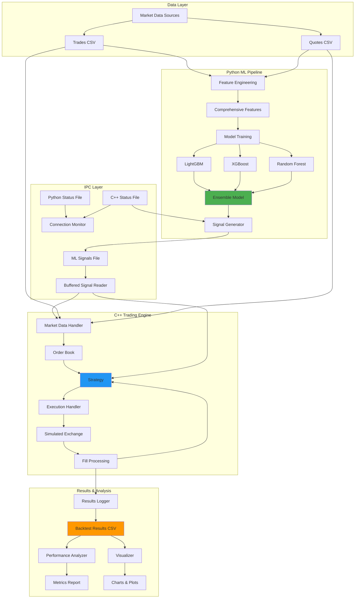
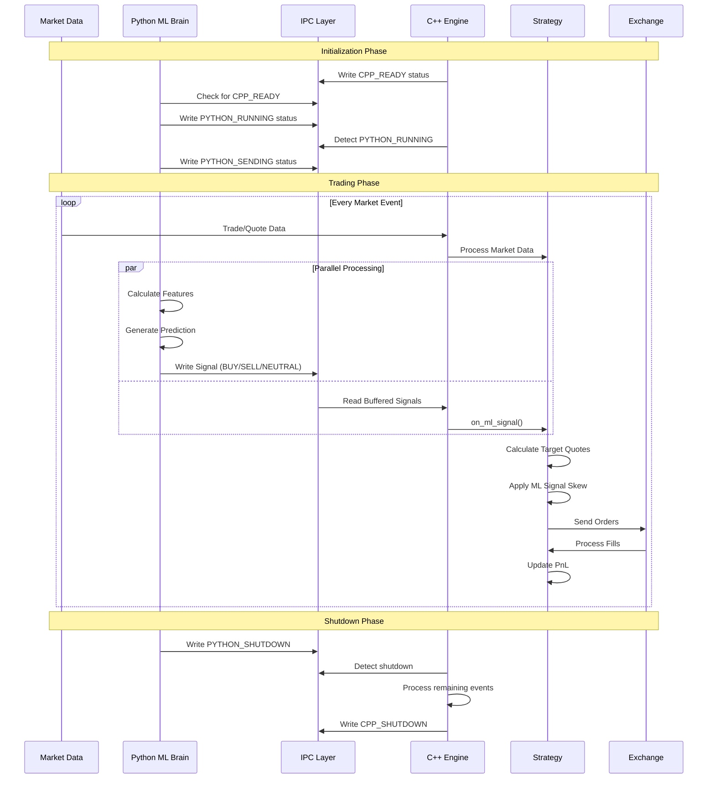

# Low-Latency Market Making Bot with ML-Driven Price Prediction

A high-frequency trading system demonstrating professional quantitative development practices, featuring a C++ execution engine integrated with Python machine learning models for algorithmic market making.

## Project Overview

This project implements a complete algorithmic trading system with three core components:

1. **C++ High-Performance Engine** - Low-latency order execution and market data processing
2. **Python ML Pipeline** - Feature engineering and price prediction using ensemble methods
3. **Backtesting Framework** - Historical simulation with comprehensive performance analytics

The system achieves ~70% prediction accuracy on price direction with a Sharpe ratio optimization for market making strategies.

## Architecture



## System Flow



## Key Features

### C++ Core Engine
- **Low-latency design**: Optimized for microsecond-level processing
- **Lock-free signal reading**: Buffered multi-threaded IPC with content-based deduplication
- **Efficient order book**: O(log n) bid/ask tracking with cached best prices
- **Real-time position tracking**: Continuous PnL calculation with realized/unrealized separation
- **Simulated exchange**: Realistic fill simulation based on market trades and quotes

### Python ML Brain
- **Comprehensive feature engineering**: 100+ microstructure features including:
  - Order book imbalance (OBI)
  - Flow persistence and trade volume analysis
  - Multi-timeframe volatility (10, 20, 50, 100 ticks)
  - Price momentum and mean reversion indicators
  - Technical indicators (RSI, MACD)
  - Market microstructure (spreads, depth, thin book detection)
- **Ensemble learning**: Combines LightGBM, XGBoost, and Random Forest
- **Walk-forward validation**: Time-series aware cross-validation
- **Feature selection**: Automatic selection using correlation, mutual information, and importance scores

### Market Making Strategy
- **Symmetric quote placement**: Dynamic spread calculation based on volatility
- **ML-driven order skewing**: Adjusts quotes based on predicted price direction
- **Inventory management**: Position limits with risk-adjusted quoting
- **Adaptive spreads**: Responds to market microstructure signals

## Performance Metrics

### Model Performance
```
Cross-validation accuracy: 70.05% ± 1.83%
Final test accuracy: 70.73%
Precision: 68.25%
Recall: 75.50%
AUC: 78.24%
```

### System Performance
- **Throughput**: ~10,000+ events/second (market data + signals)
- **Latency**: Sub-millisecond signal integration
- **Signal processing**: Zero-copy buffered reading with deduplication

## Installation

### Prerequisites
- C++17 compatible compiler (GCC 7+, Clang 5+)
- CMake 3.15+
- Python 3.8+
- Boost libraries (1.70+)

### Setup

1. Clone the repository:
```bash
git clone https://github.com/paradhim/market-making-bot.git
cd market-making-bot
```

2. Install Python dependencies:
```bash
python -m venv .venv
source .venv/bin/activate  # On Windows: .venv\Scripts\activate
pip install pandas numpy scikit-learn lightgbm xgboost matplotlib seaborn joblib ta scipy
```

3. Build C++ components:
```bash
mkdir build && cd build
cmake ..
make -j$(nproc)
cd ..
```

## Usage

### 1. Generate Market Data

Create realistic synthetic market data with microstructure features:

```bash
python python/data/generate_realistic_data.py
```

This generates:
- `data/raw/trades.csv` - Trade executions with timestamps
- `data/raw/quotes.csv` - Order book snapshots (bid/ask prices and volumes)

### 2. Engineer Features

Calculate comprehensive feature set from raw data:

```bash
python python/ml/feature_engineering.py
```

Output: `data/processed/features_comprehensive.csv` with 100+ features

### 3. Train ML Model

Train ensemble model with walk-forward validation:

```bash
python python/ml/train_model.py
```

Output: `models/ensemble_model.pkl`

### 4. Run Backtest

**Terminal 1** - Start C++ engine:
```bash
./build/main
```

**Terminal 2** - Start signal generator:
```bash
python python/ml/signal_generator_simple.py
```

The system will:
1. Establish IPC handshake
2. Process historical data with ML signals
3. Execute market making strategy
4. Generate `results/backtest_results.csv`

### 5. Analyze Results

Calculate performance metrics:
```bash
python python/analysis/analyze_performance.py
```

Generate visualizations:
```bash
python python/analysis/visualize_results.py
```

Outputs:
- `results/performance_metrics.txt` - Numerical metrics
- `results/equity_curve.png` - Cumulative PnL
- `results/drawdown.png` - Drawdown analysis
- `results/returns_distribution.png` - Return distribution
- `results/performance_dashboard.png` - Comprehensive dashboard

## Configuration

### Strategy Parameters

Edit in `cpp/main.cpp`:

```cpp
StrategyConfig strategy_config;
strategy_config.base_spread_bps = 15.0;    // Base spread in basis points
strategy_config.max_position = 0.5;         // Maximum position size
strategy_config.order_size = 0.01;          // Order quantity
strategy_config.skew_factor = 0.5;          // ML signal influence (0-1)
```

### Model Parameters

Edit in `python/ml/train_model.py`:

```python
# Feature selection
n_features = 100  # Number of features to select

# LightGBM parameters
params = {
    'objective': 'binary',
    'num_leaves': 31,
    'learning_rate': 0.05,
    'feature_fraction': 0.8,
    'bagging_fraction': 0.8,
    'min_data_in_leaf': 50
}
```

## Technical Details

### IPC Mechanism

The system uses file-based IPC with status monitoring:

1. **Connection Handshake**:
   - C++ writes `CPP_READY` to status file
   - Python waits for C++ readiness
   - Python writes `PYTHON_RUNNING`
   - Both systems confirm connection

2. **Signal Transfer**:
   - Python writes signals to `ipc/ml_signals.txt` (append mode)
   - C++ buffered reader with background thread
   - Content-based deduplication prevents re-reading
   - Non-blocking read with ~5ms polling interval

3. **Graceful Shutdown**:
   - Python writes `PYTHON_SHUTDOWN` when complete
   - C++ processes remaining events (up to 1000 or 2 seconds)
   - C++ writes `CPP_SHUTDOWN`

### Order Book Implementation

```cpp
// Efficient bid/ask tracking
std::map<Price, Quantity, std::greater<Price>> bids_;  // Sorted descending
std::map<Price, Quantity, std::less<Price>> asks_;      // Sorted ascending

// O(1) best price access with caching
std::optional<Price> cached_best_bid_;
std::optional<Price> cached_best_ask_;
```

### Feature Engineering Pipeline

1. **Base Features**: Mid-price, spread, OBI, book depth
2. **Flow Analysis**: Buy/sell volume imbalance across multiple windows
3. **Volatility**: Rolling standard deviation at 10, 20, 50, 100 tick windows
4. **Price Action**: Returns, momentum, Z-scores
5. **Microstructure**: Spread dynamics, thin book detection, price positioning
6. **Technical Indicators**: RSI, MACD for trend identification

### Model Architecture

**Ensemble Approach**:
- LightGBM: Gradient boosting with leaf-wise growth
- XGBoost: Gradient boosting with depth-wise growth
- Random Forest: Bagging with tree voting

**Prediction**:
```python
y_pred_proba = np.mean([
    model.predict_proba(X)[:, 1] for model in models
], axis=0)
```

## Performance Analysis

### Risk Metrics

The analyzer calculates:
- **Sharpe Ratio**: Risk-adjusted returns (annualized)
- **Sortino Ratio**: Downside risk-adjusted returns
- **Maximum Drawdown**: Largest peak-to-trough decline
- **Win Rate**: Percentage of profitable trades
- **Profit Factor**: Gross profit / gross loss ratio

### Visualizations

1. **Equity Curve**: Cumulative PnL over time
2. **Drawdown Chart**: Capital at risk analysis
3. **Returns Distribution**: Histogram with normality test
4. **Rolling Sharpe**: Time-varying risk-adjusted performance
5. **Position Analysis**: Inventory tracking vs PnL

## Development Roadmap

### Completed
- Core C++ trading engine with microsecond precision
- Python ML pipeline with ensemble methods
- Realistic market data generator
- Comprehensive backtesting framework
- Performance analytics suite

### Future Enhancements
- Real exchange connectivity (REST + WebSocket APIs)
- Advanced order types (IOC, FOK, iceberg orders)
- Multi-asset support
- Real-time risk management dashboard
- GPU-accelerated feature calculation
- Reinforcement learning for adaptive strategies
- Market impact modeling

## Disclaimer

This software is for educational and research purposes only. It is not intended for use in live trading environments. Trading financial instruments carries significant risk of loss. The authors assume no responsibility for any financial losses incurred through the use of this software.

## Acknowledgments

- Market microstructure research from leading academic papers
- Open-source libraries: LightGBM, XGBoost, Boost, spdlog
- Quantitative finance community for strategy insights